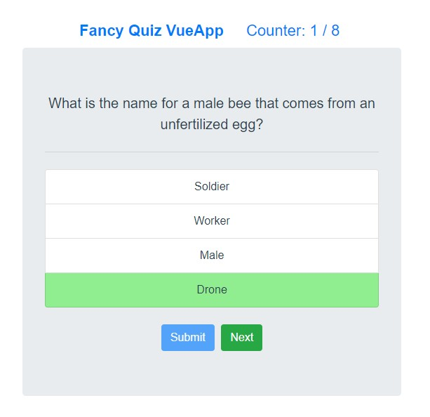

# vquiz

Just a simple animal quiz VueJS project made while learning VueJS Crash Course from FreeCodeCamp

**Steps to install:**
1. Download the project.

2. Open terminal and type: "npm run serve".

3. The site will be live at port 8080 i.e. localhost:8080

***Note: Node and VueJS must be installed.***

